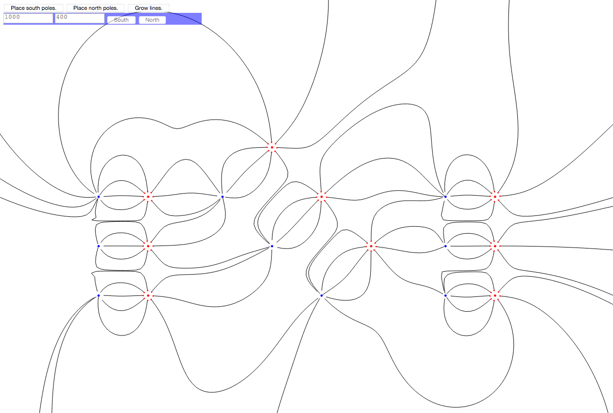
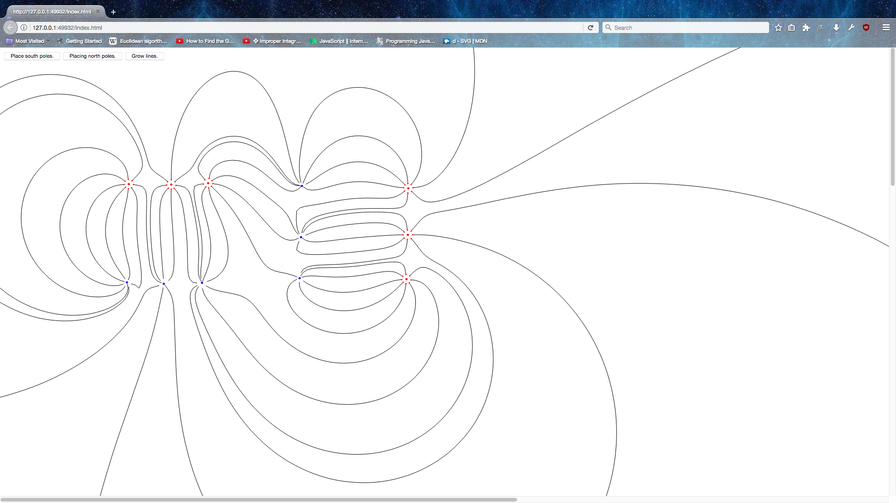

# Magnetic Line Math for Fun Part 2

This is part two of using nothing but math and reason to imitate the look and behavior of magnetic lines.

In part 1 I made a grid of compasses that oriented to the magnetic field. [part1](www.github.com/jonthemathman/magnetic-lines-part1)

In part 2 I made the lines flow continuously. I also made the starting growth points of the continuous lines move towards and away from other poles so that the growth points weren't static.

### Disclaimer:
This program is in no way intended to be a real magnetic line simulator and any result found with this program could be wrong. This program is just for trying to mimic the look and behaviour of magnetic lines with math. It is only for fun so have fun!

### Potential ToDo

- [ ] Make something like animation tweens so that the poles and lines can be animated.